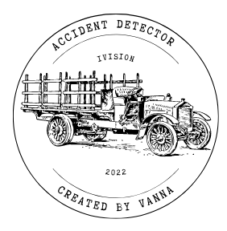
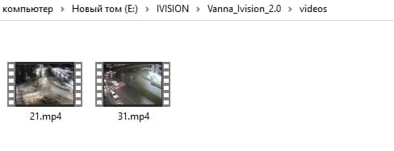
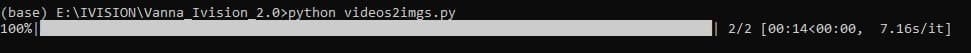
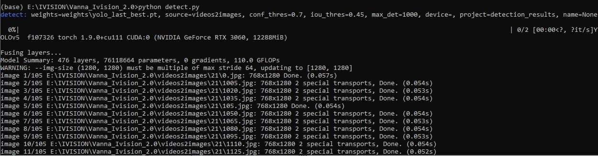
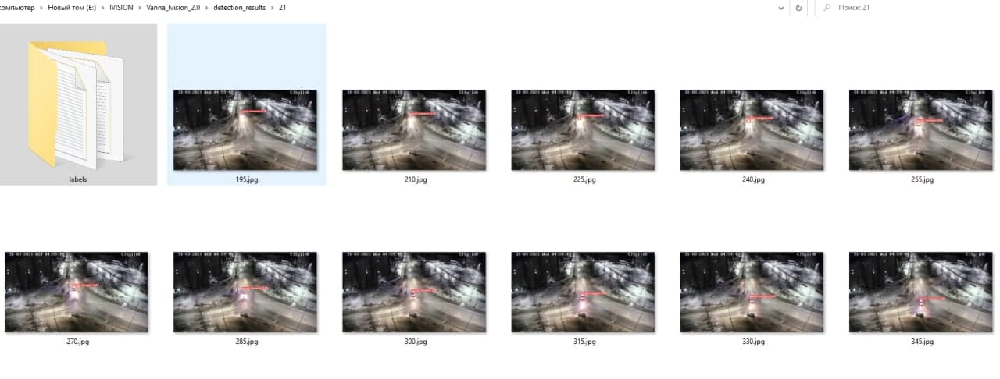
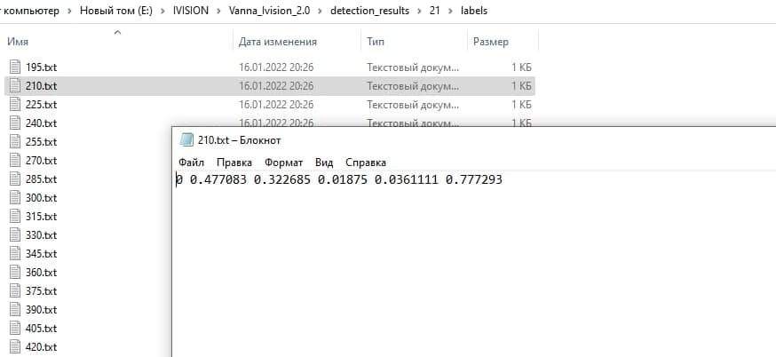
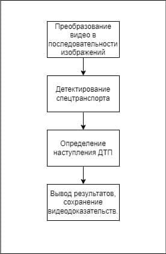
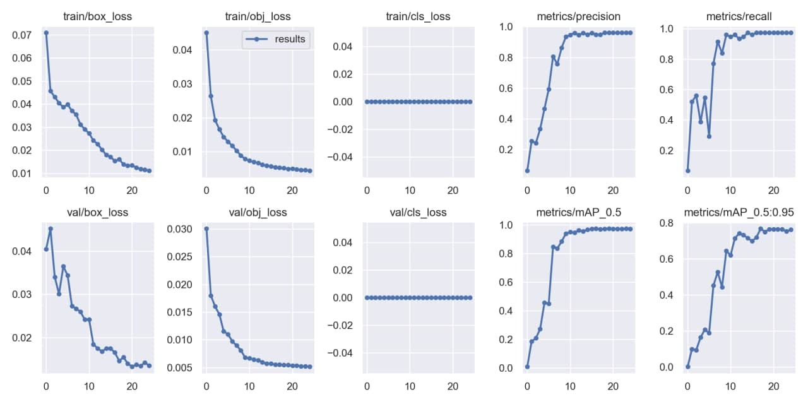
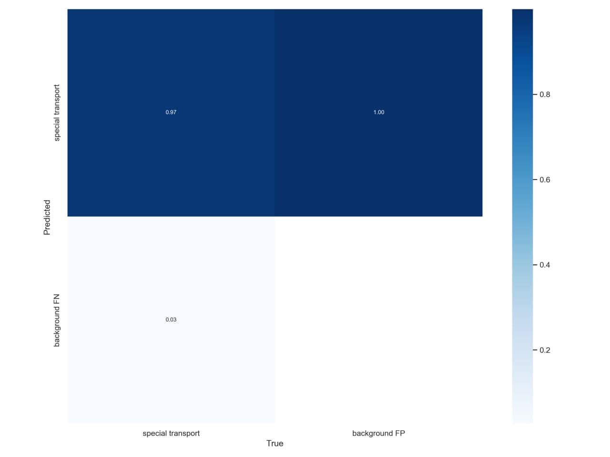

<h1 align="center">🚒 Accident Detector 🚒</h1>

  
 

## ***Навигация***
- [Описание](#описание)
- [Как пользоваться программой](#как_пользоваться)
- [Как это работает?](#как_это_работает)
- [О проекте и технологиях](#о_проекте_и_технологиях)
  - [Архитектура](#архитектура)
  - [Реализованные модели](#реализованные_модели)
  - [Computer Vision & Machine Learning](#computer_vision_and_machine_learning)
  - [Обучение модели](#обучение_модели)
  - ["Подводные камни"](#подводные_камни)
- [Installation](#installation)
- [Возможные проблемы](#проблемы)

 
## ***Описание***

Программа реализована для распознавания ДТП и специальной техники на видеозаписях с камер наружного наблюдения. Возможна поддержка в "real-time" (онлайн режим).
С такой программой пользователь сможет заранее проверить ситуацию на дорогах, причину возникновения "пробки" и построить для себя удобный вариант маршрута.

 
## ***Как пользоваться программой***

1) Помещаем видео в папку videos.

2) Преобразовываем видео в последовательность изображений (доступен Progress Bar).

3) Запуск детектора объектов для всех директорий из videos2images 

4) Результаты работы детектора объектов

 
## ***Как это работает?***

Изначально, все видеофайлы из папки videos преобразуются в последовательность кадров. 
Первоначальный расчёт на то, что fps у тестовых видео будет такой же, как и у тех, что были предоставлены для исследование, т.е. 30. 
- Из видео каждую секунду берётся 2 кадра. 
- Затем последовательности кадров обрабатывается детектором объектов с порогом уверенности 0.7. Таким образом, в папке detection_results для всех видеофайлов, которые преобразовались в последовательность кадров, появятся результаты работы детектора объектов. В папке labels в каждом файле хранится информация о местонахождении объекта (bouning box) + уверенность (confidence).  
- Логика определения ДТП заключена в dtp.py. Мы считаем, что ДТП случилось в том случае, если на минимум 10 изображения был найден спецтранспорт с увереностью нейронной сети >=0.7. В случае наступления ДТП, в папке proof появится видеофайл, а также в консоль будет выведено соответствующее сообщение.

 
## ***О проекте и технологиях***

 
### Архитектура

 

 
### Реализованные модели

 
### Computer Vision & Machine Learning

**Технонологии**:
- [OpenCV](https://opencv.org/)
- [ffmpeg](https://www.ffmpeg.org/)
- [PyTorch](https://pytorch.org/)
- [YOLOv5](https://github.com/ultralytics/yolov5)
- [WandDB](https://wandb.ai/site)
- [Roboflow](https://roboflow.com/)

 
### Обучение модели

*Метрики оценивания:*

 

а  |  б
:-------------------------:|:-------------------------:
  |  
  |  

*Детекция объектов:*
Детекция с вероятностью    |  Детекция без вероятности
:-------------------------:|:-------------------------:
  |  

*Train metrics:*

Confusion Matrix:

 
### ***Подводные камни***

 
## ***Installation***

- Установить пакеты из requirements.txt:

  `pip install –r requirements.txt`
- Скачать файлы моделей по [ссылке] (https://drive.google.com/drive/folders/1SnG5JwYExb_aabh7PZWeJ14M50yia6uv?usp=sharing)
- Перенести их в weights

 
## ***Возможные проблемы***

В случае, если алгоритм не определил ДТП, возможны следующие улучшения:
- Увеличения количество изображений при преобразовании из видео в изображения. 
python videos2imgs.py  --when 5
Таким образом, будет сохранен каждый 5-ый кадр, мы увеличим количество изображений в папках втрое. Повторить шаги, начиная с detect.
- Если ролики короткие и не применяли шаг выше, то следует изменить параметр --thresh для is_dtp.py на 7 или 5.
python is_dtp.py --thresh 7
- Если это не помогло, то изменяем confidence threshold для детектора объектов на 0.6
python detect.py  --conf-thres 0.6
Теперь python is_dtp.py --thresh 7 --conf 0.6
- В случае, если происходят ложные срабатывания, то увеличиваем параметры --thresh до 15-20 или
 --conf до 0.75-0.85.
